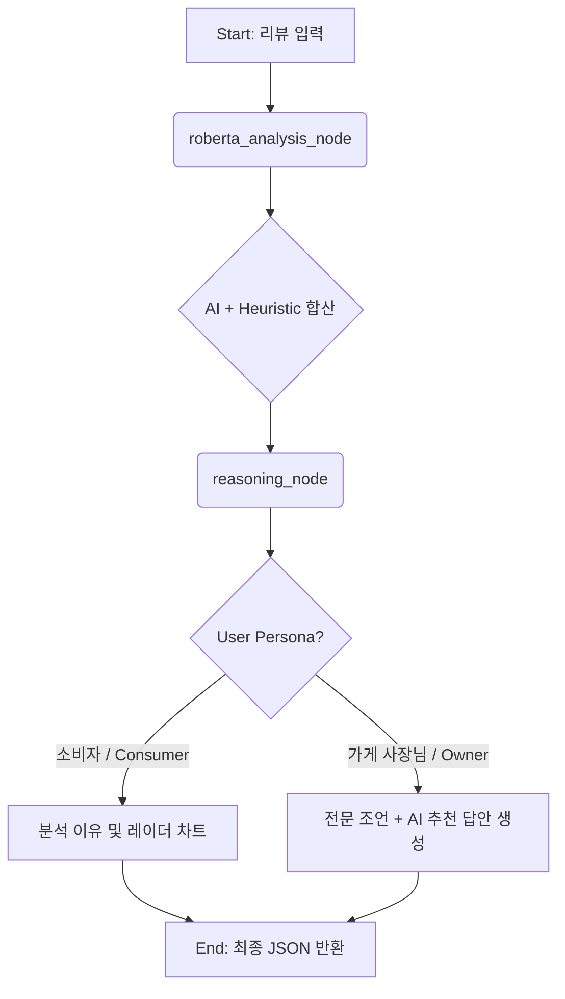

# 🏗️ 배달 음식 리뷰 AI 감성 분석 에이전트 시스템 아키텍처

---

## 1. 시스템 개요 (Overview)
본 시스템은 기존의 단순 순차적 처리 방식을 탈피하여, **그래프 기반의 상태 분기(State Management)**와 하이브리드 추론 엔진(AI + Heuristics)을 결합한 고도화된 AI 시스템입니다. 

딥러닝 모델(RoBERTa)의 강력한 문맥 이해 능력과 전문가 시스템(Expert System)의 정교한 규칙 로직을 결합하여, 실무 비즈니스에서 요구되는 높은 신뢰성과 빠른 응답 속도를 동시에 확보했습니다.

## 2. 하이브리드 감성 분석 엔진 (Hybrid Engine)
시스템의 핵심은 딥러닝과 규칙 기반 로직의 상호 보완 구조입니다.

*   AI Layer (RoBERTa): Hugging Face 기반의 파인튜닝된 모델이 문장의 전반적인 감정 톤을 1차적으로 분류합니다.
*   Heuristic Layer (Keyword Mapping): 배달 도메인 특화 키워드 사전(맛, 배달, 가격/양, 위생 등)을 사용하여 모델의 블랙박스적 한계를 보완하고 구체적인 근거를 추출합니다.

## 3. 에이전트 워크플로우 (LangGraph Flow)

시스템은 LangGraph를 통해 분석의 각 단계를 노드(Node)별로 격리하고, `GraphState`를 통해 유기적으로 데이터를 공유합니다.

### 🧠 주요 노드 구성 및 역할

1.  `roberta_analysis_node` (하이브리드 분석 노드)
    - AI 분류:** RoBERTa 모델을 통한 긍정/부정 확률 도출.
    - 키워드 스캐닝: '맛', '배달', '가격/양' 등 항목별 키워드 매핑을 통한 점수 산출.
    - 오판 방지(Fail-safe): 모델이 긍정으로 판단하더라도 '이물질', '벌레' 등 치명적 키워드 감지 시 강제 부정 처리.
2.  `reasoning_node` (Zero-LLM 추론 노드)
    - 성능 최적화: LLM(GPT 등) 호출 없이 로컬 규칙 엔진을 사용하여 **지연 시간(Latency)을 0에 가깝게 구현.
    - 전략적 조언: 분석된 부정 요소를 기반으로 사장님에게 필요한 실무적 개선 포인트(레시피 점검, 포장 보완 등)를 무작위성 기반의 전문 지식 데이터셋에서 매칭.
    - 맞춤형 답안: 페르소나와 감성에 최적화된 응대 템플릿을 조합하여 최종 결과물 생성.

## 4. 핵심 판정 로직 (Verdict Algorithm)

단순한 감성 분류를 넘어 다각도의 분석을 통한 최종 라벨(`final_label`) 확정 로직을 포함합니다.

| 판정 유형 | 로직 (Logic) | 특징 |
| :--- | :--- | :--- |
| 지배적 판정| 긍정/부정 요소가 2개 이상일 때 | 명확한 사용자 의도 반영 |
| 애매함 판정 | 긍정/부정 요소가 같거나 '무난', '평범' 등 중립 표현 존재 시 | 신중한 분석 결과 제시 |
| Fail-safe | 위생/이물질 관련 키워드 포착 시 | 모델 점수와 무관하게 즉각 부정 처리 |

## 5. 기술 스택 (Tech Stack)

| 계층 | 기술 스택 | 주요 특징 |
| :--- | :--- | :--- |
| Orchestration | LangGraph | 상태 기반 워크플로우 관리 및 에이전트 노드 분리 |
| AI Model | RoBERTa (Transformers) | 배달 도메인 특화 텍스트 분류 (정확도 95%) |
| Reasoning | Rule-based Expert System | LLM 의존성 제거를 통한 고성능·저비용 추론 구현 |
| API Layer | FastAPI | 고성능 비동기 API 서빙 및 Pydantic 데이터 검증 |
| Visuals | Recharts | 레이더 차트를 통한 다각도 감성 시각화 |

---

## 💡 종합 평가 (Summary)
본 아키텍처는 딥러닝의 유연성**과 규칙 기반 시스템의 견고함을 LangGraph라는 오케스트레이터 위에서 완벽히 통합했습니다. 특히 추론 단계에서 LLM 의존성을 제거하여 실서비스 수준의 반응 속도를 확보한 점이 본 시스템의 가장 큰 기술적 차별점입니다.
