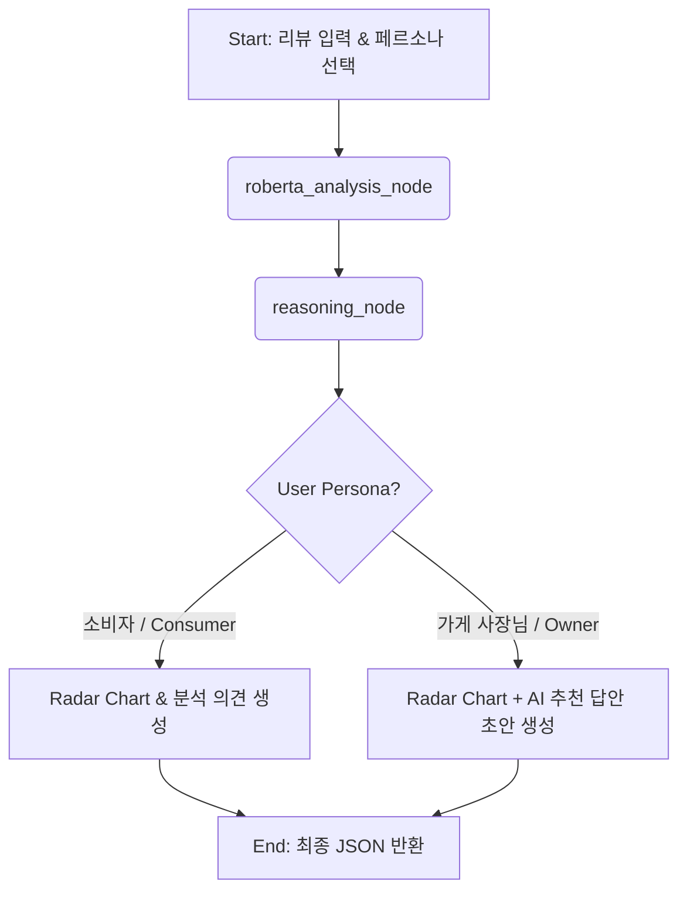

# 🏗️ 배달 음식 리뷰 AI 감성 분석 에이전트 시스템 아키텍처

본 문서는 `my-chatbot` 프로젝트의 백엔드 파이프라인(`review.py`)을 구성하는 **LangChain 및 LangGraph** 기반의 지능형 에이전트 구조를 상세히 설명합니다.

---

## 1. 시스템 개요 (Overview)
본 시스템은 기존의 단순 순차적 처리 방식을 탈피하여, **그래프 기반의 상태 분기(State Management)**와 **하이브리드 추론 엔진**을 결합한 고도화된 AI 시스템입니다. 

딥러닝 모델(RoBERTa)의 강력한 문맥 이해 능력과 전문가 시스템(Expert System)의 정교한 규칙 로직을 결합하여, 소비자에게는 신뢰할 수 있는 분석을, 사장님에게는 즉각적인 응대 전략을 서빙합니다.

## 2. 딥러닝 모델 파인튜닝 (AI Engineering)
시스템의 지능적 중추인 RoBERTa 모델은 국내 배달 앱 데이터에 특화되어 설계되었습니다.

*   **모델 아키텍처:** Hugging Face **RoBERTa-Base** 파인튜닝
*   **학습 기반:** 배달의민족, 요기요, 쿠팡이츠 등 국내 주요 배달 플랫폼의 리뷰 데이터셋
*   **성과:** 배달 도메인 전용 문장(줄임말, 배달 특유의 표현 등)에 대해 **약 95%의 감성 분류 정확도** 확보

## 3. 에이전트 워크플로우 (LangGraph Flow)

시스템은 **LangGraph**를 통해 분석의 각 단계를 노드(Node)별로 격리하고, `GraphState`를 통해 체계적으로 데이터를 관리합니다.

### 🧠 주요 노드 구성 및 역할

1.  **`roberta_analysis_node` (AI 분석 노드)**
    - 파인튜닝된 RoBERTa 모델을 통해 텍스트의 1차 감성 임베딩을 수행합니다.
    - 확률 기반의 감성 점수(Classification Score)를 도출하고 시스템 상태에 기록합니다.
2.  **`reasoning_node` (추론 및 보정 노드)**
    - **프롬프트 엔지니어링** 원리가 적용된 규칙 추론 엔진입니다.
    - '맛', '배달', '위생', '가격' 등 다중 카테고리에서 키워드를 추출하여 모델의 오판을 방어(Fail-safe)합니다.
    - 사용자 페르소나에 따라 조언의 톤앤매너를 조정합니다.

## 4. 데이터 계층 및 기술 스택 (Tech Stack)

| 계층 | 기술 스택 | 주요 특징 |
| :--- | :--- | :--- |
| **Orchestration** | **LangChain / LangGraph** | 상태 기반 워크플로우 관리 및 에이전트 노드 분리 |
| **AI Model** | **Transformers (RoBERTa)** | 배달 도메인 특화 텍스트 분류 (정확도 95%) |
| **Reasoning** | **Hybrid Rule Engine** | AI 블랙박스 문제를 보완하는 논리적 추론 및 보정 |
| **API Layer** | **FastAPI** | 고성능 비동기 API 서빙 및 Pydantic 데이터 검증 |
| **Frontend** | **React & Recharts** | 실시간 레이더 차트 시각화 및 페르소나별 UI 대응 |

## 5. 사용자 페르소나별 처리 로직 (Target Personas)

### 👤 일반 사용자 (Consumer)
- **목표:** 해당 리뷰가 얼마나 객관적이고 신뢰할 수 있는지 판단 지원.
- **결과:** 카테고리별 5점 척도 스파이더 차트 및 분석 이유 제시.

### 👨‍🍳 가게 사장님 (Owner)
- **목표:** 불만 사항에 대한 빠른 대응 및 긍정 리뷰에 대한 효율적인 단골 고객 확보.
- **결과:** 소비자용 결과 + **AI 추천 답글 초안 (Positive/Negative 대응 템플릿 최적화)** 제공.

---

## 💡 종합 평가 (Summary Review)
본 아키텍처는 단순히 AI를 호출하는 수준을 넘어, **LangGraph를 통한 체계적인 에이전트 설계**와 **비즈니스 목적에 따른 페르소나 분화**를 성공적으로 구현했습니다. 이는 복잡한 실무 비즈니스 로직을 AI 시스템 위에 안정적으로 구축할 수 있는 소프트웨어 설계 역량이 투영된 결과물입니다.
